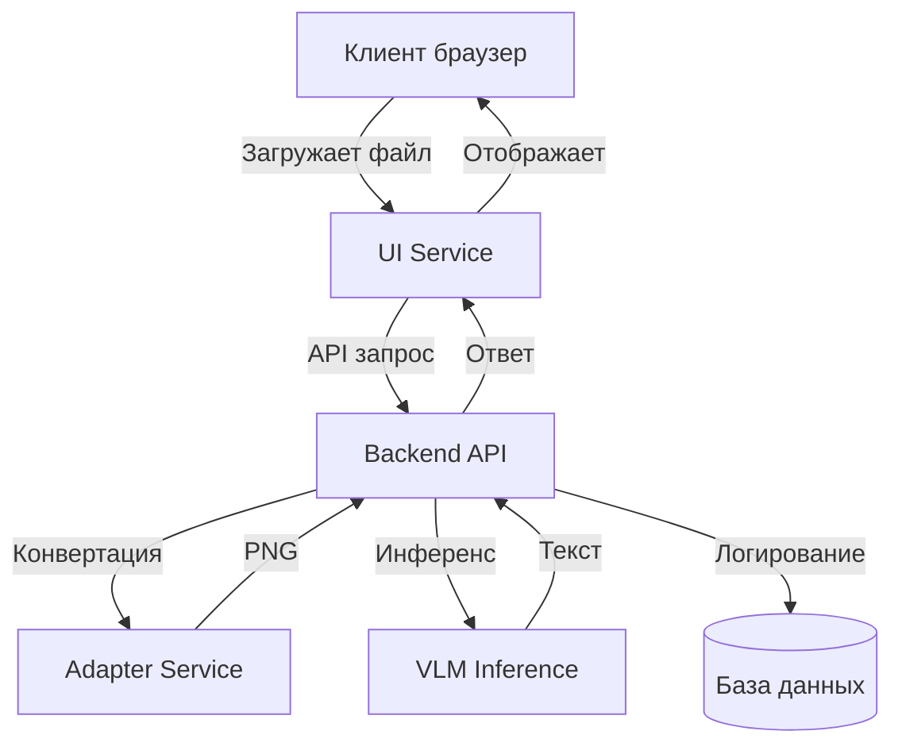

# Сервис распознавания алгоритмов по диаграммам

## О проекте

Сервис предназначен для автоматического распознавания структуры алгоритма по изображению диаграммы (блок-схемы, BPMN и др.) и генерации формализованного текстового описания. Возможна также обратная задача (опционально).

## Архитектура

Система построена по микросервисной архитектуре, каждый компонент работает в отдельном Docker-контейнере. Взаимодействие между сервисами происходит через HTTP REST API.

### Компоненты



#### 1. Backend (API сервис)

**Что делает?:** прием запросов, координация работы других сервисов, возврат результата клиенту.

- Реализован на Python с использованием FastAPI.
- Предоставляет REST API с эндпоинтом `/api/v1/process` для загрузки файлов.
- При получении файла определяет его тип и, если требуется, вызывает **Универсальный адаптер** для преобразования в PNG.
- Затем передаёт изображение сервису **VLM Inference** для получения текстового описания.
- Логирует запросы и результаты в базу данных (опционально).
- Возвращает JSON с описанием алгоритма.

#### 2. Универсальный адаптер (Converter Service)

**Что делает?:** нормализация разнородных форматов диаграмм к единому растровому представлению (PNG).

- Поддерживает форматы:
  - BPMN (.bpmn)
  - PlantUML (.puml)
  - Mermaid (.mmd)
  - Draw.io (.drawio)
  - Растровые изображения (.png, .jpg) пропускаются без изменений.
- Для конвертации используются открытые инструменты:
  - PlantUML Server (Java) или библиотека `plantweb`
  - `mermaid-cli` (Node.js)
  - `bpmn-js` + headless браузер (Puppeteer)
- Предоставляет простой API: принимает файл, возвращает PNG.

#### 3. VLM Inference

**Что делает?:** распознавание диаграммы и генерация текстового описания алгоритма.

- В качестве модели выбрана **Qwen3-VL-7B** – современная визуально-языковая модель с хорошим пониманием диаграмм.
- Инференс выполняется с помощью **Ollama** (или **vLLM**), что позволяет работать как на GPU, так и на CPU (с квантованием).
- Сервис предоставляет REST эндпоинт, принимающий PNG и возвращающий текст.

#### 4. UI (пользовательский интерфейс)

**Что делает?:** простой веб-интерфейс для демонстрации возможностей сервиса.

- Статические HTML/CSS/JS файлы, обслуживаемые Nginx.
- Содержит форму загрузки файла, отображает результат описания.


#### 5. Хранилище (логгирование)

**Что делает?:** сохранение истории запросов для анализа и избежания дублирования.

- В MVP используется SQLite (лёгкая, встраиваемая).
- При необходимости может быть заменена на PostgreSQL.
- Сохраняет хэш изображения, полученный текст, метаданные (модель, время, параметры).

## Технологический стек

| Компонент             | Технологии                                                     |
| --------------------- | -------------------------------------------------------------- |
| Backend               | Python 3.11, FastAPI, Uvicorn, httpx, SQLAlchemy               |
| Универсальный адаптер | Python, FastAPI, внешние конвертеры (Node.js, Java, Puppeteer) |
| VLM Inference         | Ollama / vLLM, Qwen3-VL-7B (или Qwen3-VL-2B)                   |
| UI                    | HTML5, JavaScript (Vanilla), Bootstrap, Nginx                  |
| База данных           | SQLite                                                         |
| Контейнеризация       | Docker, Docker Compose                                         |
| Документация API      | Swagger/OpenAPI                                                |


## Обоснование выбора технологий

- **FastAPI** – асинхронный фреймворк с высокой производительностью, встроенной валидацией и автоматической генерацией документации. Лицензия MIT.
- **Ollama** – простой способ запуска LLM с поддержкой CPU/GPU, имеет MIT лицензию. Позволяет легко менять модели и масштабировать инференс.
- **Qwen3-VL** – открытая VLM с лицензией Apache 2.0, демонстрирует высокое качество понимания изображений, включая диаграммы. Модели доступны в размерах 2B и 7B, что позволяет работать на CPU с квантованием.
- **Конвертеры** – выбраны наиболее распространённые open-source инструменты с лицензиями, совместимыми с Apache 2.0 / MIT.
- **SQLite** – не требует отдельного сервера, идеальна для MVP; лицензия public domain.
- **Docker** – стандарт для изоляции и воспроизводимости, гарантирует одинаковое окружение на всех этапах.

## Производительность и масштабируемость

### Оценка задержки

- Конвертация в PNG: в зависимости от формата занимает от 1 до 3 секунд.
- Инференс модели:
  - На GPU (RTX 5060 8GB) с Qwen3-VL-7B: ~5–10 секунд.
  - На CPU (современный многоядерный процессор) с 8-битной квантованной версией: до 20 секунд.
- Общая задержка укладывается в требуемые 20 секунд.

### Масштабируемость

- Все сервисы, кроме базы данных (решается шардированным postgres), не имеют состояния, что позволяет легко запускать несколько реплик.
- Backend может балансировать запросы между несколькими экземплярами адаптера и VLM.
- При увеличении нагрузки можно добавить очередь сообщений (RabbitMQ/Kafka) для асинхронной обработки.
- База данных может быть заменена на кластер PostgreSQL для отказоустойчивости.
- Легко перенести в k8s

## Развёртывание

Проект поставляется в виде Docker-образов и `docker-compose.yml`. Для запуска:

```bash
docker-compose up -d
```

## API

Основной эндпоинт:

- **POST /api/v1/process**  
  Принимает файл в multipart/form-data с полем `file`.  
  Возвращает JSON:  
  ```json
  {
    "description": "Текстовое описание алгоритма..."
  }
  ```

Дополнительные эндпоинты (healthcheck, метрики) описаны в Swagger.
